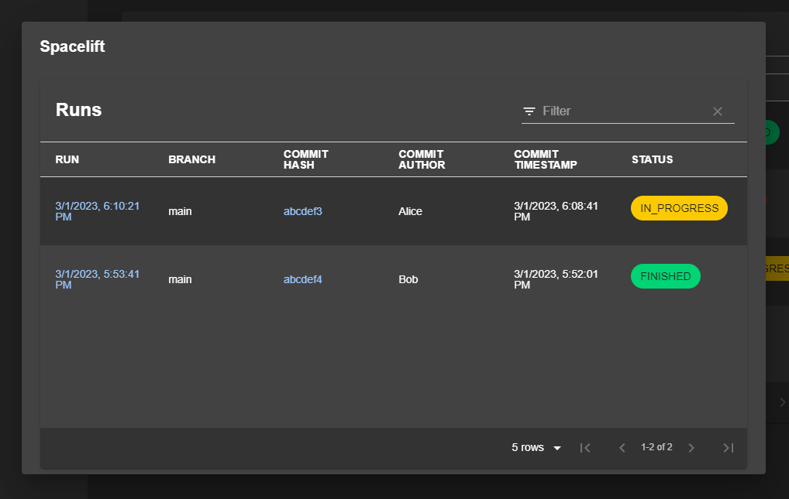

# Spacelift Backstage Plugins

A backstage plugin for spacelift, cobbled together one Sunday afternoon by @scott-the-programmer using ChatGPT

This repository contains two Backstage plugins for integrating with the Spacelift platform:

- `spacelift`: a plugin that displays a table of all Spacelift stacks and runs
- `spacelift-api`: a plugin that provides a simple wrapper for the Spacelift API.




## Installation

To use these plugins, you'll first need to install them in your Backstage app.

```bash
yarn add @scott-the-programmer/backstage-plugin-spacelift @scott-the-programmer/backstage-plugin-spacelift-backend
```

### Backend

Create the following file under `packages/backend/src/plugins/spacelift.ts`

```typescript
import { createRouter } from '@scott-the-programmer/backstage-plugin-spacelift-backend';
import { Router } from 'express';
import { PluginEnvironment } from '../types';

export default async function createPlugin({
  logger,
  config,
}: PluginEnvironment): Promise<Router> {
  return await createRouter({ logger: logger, config: config });
}
```

Add the following snippets to `packages/backend/src/index.ts`

```typescript
import spacelift from './plugins/spacelift';
...
const spaceliftEnv = useHotMemoize(module, () => createEnv('spacelift'));
...
  apiRouter.use('/spacelift', await spacelift(spaceliftEnv));
```

### Frontend

Add the following snippets to packages/app/src/App.tsx

```tsx
import { SpaceliftPage } from '@scott-the-programmer/backstage-plugin-spacelift';
...
<Route path="/spacelift" element={<SpaceliftPage />} />
```

Add the following snippets to Root.tsx to add spacelift to the home sidebar

```tsx
<SidebarItem icon={LibraryBooks} to="spacelift" text="Spacelift" />
```

### Config

Add the following config to your app-config.yaml

```
spacelift:
  org: your-spacelift-org
  id: your-spacelift-id
  secret: your-spacelift-secret
```
